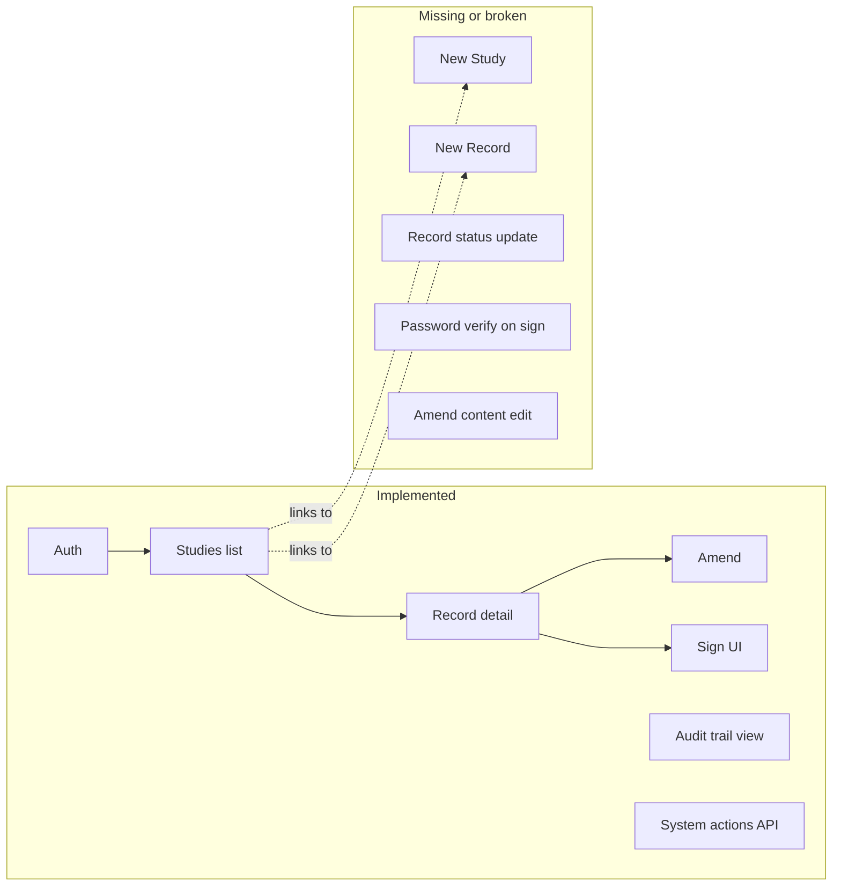

# AuditWiz: Current State Analysis and Next Steps

## Current state summary

The app is a **clinical-ready research auditing platform** (Next.js 16, Supabase) with a strong foundation: immutable records, append-only audit events, study-scoped RBAC, and electronic signatures. The schema, RLS, triggers, and libs ([lib/supabase/audit.ts](lib/supabase/audit.ts), [lib/supabase/permissions.ts](lib/supabase/permissions.ts), [lib/crypto.ts](lib/crypto.ts)) align with [ARCHITECTURE.md](ARCHITECTURE.md). Several core user flows are missing or broken.

---

## Critical gaps (bugs / missing flows)

| Issue                                       | Location                                                                                                                                                                                                                   | Impact                                                 |
| ------------------------------------------- | -------------------------------------------------------------------------------------------------------------------------------------------------------------------------------------------------------------------------- | ------------------------------------------------------ |
| **No "New Study" route**                    | App links to `/studies/new` but route does not exist                                                                                                                                                                       | Users cannot create studies                            |
| **No "Create Record" route**                | App links to `/studies/[id]/records/new` but only `[recordId]` exists                                                                                                                                                      | Users cannot create records                            |
| **Record status update blocked**            | [components/records/sign-record-button.tsx](components/records/sign-record-button.tsx) calls `supabase.from('records').update({ status: 'approved' })`; schema has **no UPDATE policy** on `records` (immutable by design) | Approval does not persist; record stays "under_review" |
| **Signature password not verified**         | Same file: "For production, you would verify the password here"                                                                                                                                                            | Re-authentication is not enforced                      |
| **Amendment does not allow content change** | [components/records/amend-record-button.tsx](components/records/amend-record-button.tsx) uses `newContent = currentRecord.content` (no form for amended content)                                                           | Amendments only add a reason, not changed content      |

---

## Logic and functionality improvements

**1. Add missing routes and forms**

- `**/studies/new**`: Page with form (title, description, status). On submit: insert into `studies`, insert current user into `study_members` as `creator`/`admin`, optionally call `create_audit_event` for `study_created` (or rely on DB trigger if you add one for studies).
- `**/studies/[id]/records/new**`: Page with form for `record_number` and initial `content` (e.g. JSON or structured fields). Compute `content_hash` (reuse [lib/crypto.ts](lib/crypto.ts)), insert into `records`. Trigger already creates `record_created` audit event.

**2. Record status transitions (aligned with immutability)**

- Options (choose one):
  - **A. Allow status-only updates in DB:** Add a single RLS policy on `records` for `UPDATE` that allows only `status` to change (and only for study members with approver/reviewer role), keeping `content` and version immutable. Then the existing sign button’s `update({ status: 'approved' })` works.
  - **B. Do not update record status from client:** Expose a small API route (e.g. `POST /api/records/[recordId]/status`) that checks permissions, updates only `status`, and optionally creates an audit event for status change. Client calls this instead of direct Supabase update.

**3. Enforce re-authentication when signing**

- In [components/records/sign-record-button.tsx](components/records/sign-record-button.tsx), before creating the signature, call `supabase.auth.reauthenticate()` or `signInWithPassword` with the entered password (or use Supabase’s recommended re-auth flow). If it fails, show error and do not create the signature.

**4. Amendment flow: editable content**

- In [components/records/amend-record-button.tsx](components/records/amend-record-button.tsx), add a content-editing step (e.g. JSON textarea or field-based form) so the new version has amended content plus `amendment_reason`. Compute new `content_hash` from the amended content and insert the new row as today.

**5. Middleware deprecation (Next.js 16)**

- Rename [middleware.ts](middleware.ts) to `proxy.ts` and export `proxy` instead of `middleware` (or run the codemod `npx @next/codemod@canary middleware-to-proxy`) to clear the build warning.

**6. Audit events for study creation**

- If you want study creation in the audit trail, add a DB trigger on `studies` (INSERT) that calls `create_audit_event` for `study_created`, or call [createAuditEvent](lib/supabase/audit.ts) from the new study creation server action/route after insert.

**7. Dashboard records count**

- [app/dashboard/page.tsx](app/dashboard/page.tsx) counts records with no study filter; RLS still restricts to the user’s studies. Optionally scope the count explicitly (e.g. studies the user is a member of) for clarity and future-proofing.

---

## Next steps: advanced features (prioritized)

**Phase 1 – Core flows (prerequisite for real use)**

1. Implement **New Study** and **New Record** routes and forms (see above).
2. Fix **record status update** (RLS or API) and **signature re-auth**.
3. Add **amend with content change** and optional study-created audit.

**Phase 2 – Workflow and transparency**

1. **Status workflow and submit for review**
  - Add explicit actions: "Submit for review" (draft → submitted/under_review), "Reject" (with optional reason), "Approve" (already partially there via sign).  
  - Optionally store status-change reasons in `audit_events.metadata` or a small status_history table.
2. **Study member management UI**
  - Page (e.g. `/studies/[id]/members`) for admins: list members, add (email + role), revoke (set `revoked_at`). Use [canManageStudyMembers](lib/supabase/permissions.ts). Emit `member_added` / `member_removed` / `member_role_changed` (via API or DB triggers).
3. **Record submission and “under review”**
  - Ensure status can move to `under_review` when appropriate (e.g. after "Submit for review") and that only then approvers see "Sign Record" (already gated in [app/studies/[id]/records/[recordId]/page.tsx](app/studies/[id]/records/[recordId]/page.tsx)).

**Phase 3 – Documents and export**

1. **Document attachments**
  - Use Supabase Storage (or Web3.storage per README): upload linked to `record_id`, store `file_path`, `file_hash`, `file_size`, `mime_type` in `documents`. RLS already exists. Add UI on record detail: list documents, upload, optional download. Emit `document_uploaded` (trigger or app).
2. **Audit report export**
  - API route or server action: filter `audit_events` by study and date range, return CSV/JSON or generate a PDF. Use [getAllAuditEvents](lib/supabase/audit.ts) or a new function that returns events with actor/study info.

**Phase 4 – Blockchain and AI (from README/ARCHITECTURE)**

1. **Blockchain anchoring**
  - Implement [lib/blockchain.ts](lib/blockchain.ts): on final approval (e.g. status → approved and optional “anchor” action), call Alchemy (or chosen chain) to store `content_hash`, then insert into `blockchain_anchors` and emit `blockchain_anchored` audit event. Optional: verify endpoint to check anchor on-chain.
2. **AI / system actions integration**
  - Use existing [POST /api/system-actions](app/api/system-actions/route.ts) from any automation: pass `studyId`, `actionType`, `targetEntityType`, `targetEntityId`, state hashes, and `systemMetadata` (e.g. `model_version`, `input_hash`, `output_hash`). Add UI hints (e.g. badge "System Action" on audit trail; already present on [dashboard/audit-trail](app/dashboard/audit-trail/page.tsx)).

**Phase 5 – Optional enhancements**

1. **Study metadata and workflows**
  - Use `studies.metadata` for phases, record templates, or simple workflow config; add UI to edit study settings and optional phase transitions.
2. **ORCID / OAuth**
  - Add ORCID (or other) OAuth for sign-in and attach identity to `auth.users` or profile for audit display.
3. **Record templates**
  - Store templates in `studies.metadata.record_templates` and prefill "Create Record" form from a selected template.

---

## Suggested implementation order

| Step | Task                                                          | Dependencies                       |
| ---- | ------------------------------------------------------------- | ---------------------------------- |
| 1    | Add `/studies/new` page and study creation                    | None                               |
| 2    | Add `/studies/[id]/records/new` page and record creation      | None                               |
| 3    | Fix record status update (RLS or API) and re-auth for signing | None                               |
| 4    | Amendment with content edit                                   | Step 2                             |
| 5    | Migrate middleware → proxy                                    | None                               |
| 6    | Study members UI                                              | Step 1                             |
| 7    | Submit for review / reject flows                              | Step 3                             |
| 8    | Document upload and list                                      | Step 2                             |
| 9    | Audit export API                                              | None                               |
| 10   | Blockchain anchoring (real implementation)                    | Step 3, env (e.g. ALCHEMY_RPC_URL) |

This keeps the current architecture intact (immutability, audit, RBAC) while fixing broken flows and then layering on advanced features in a logical order.